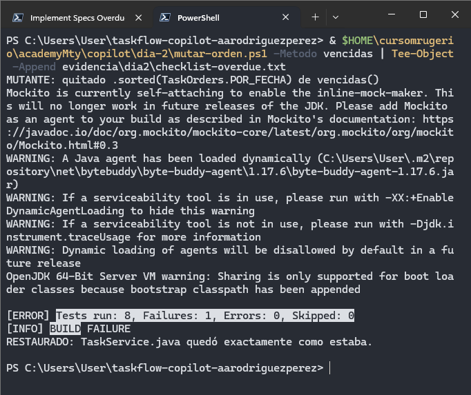
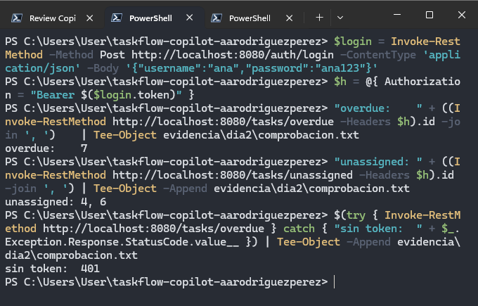
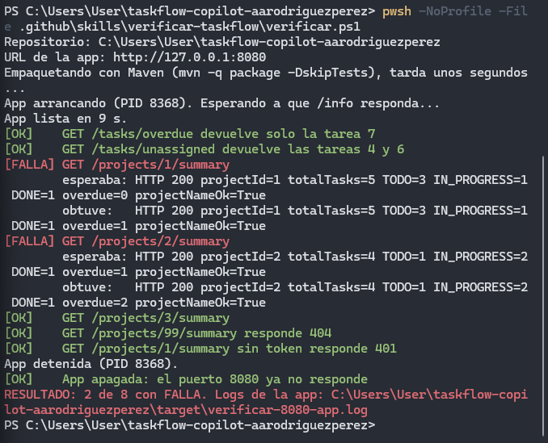
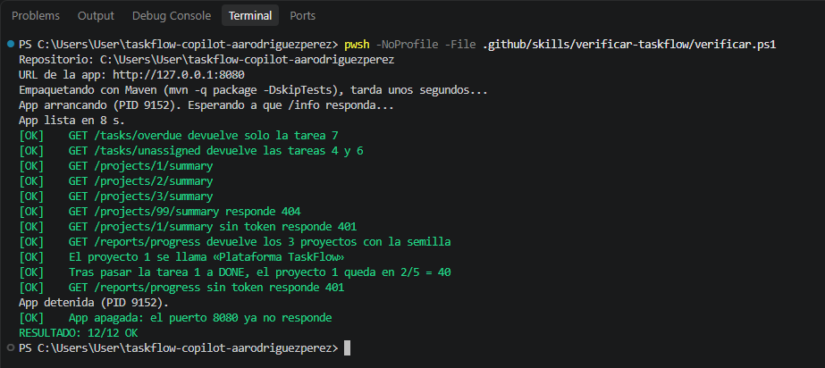
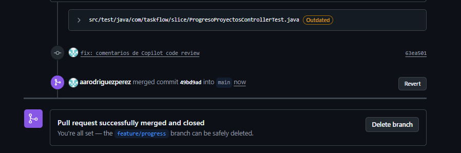

# Evidencia de la semana · GitHub Copilot

**Alumno:** Alberto Alejandro Rodríguez Pérez  
**Usuario de GitHub:** `aarodriguezperez`  
**Repositorio:** https://github.com/aarodriguezperez/taskflow-copilot-aarodriguezperez

Este documento resume el trabajo realizado durante la Semana 6. La evidencia detallada permanece dentro de `evidencia/` y la documentación paso a paso de cada día se encuentra en `docs/`.

---

## Día 1 · La CLI y el repositorio

- **Qué construí:** preparé un repositorio propio de TaskFlow para trabajar con GitHub Copilot CLI, configuré las instrucciones permanentes del proyecto y generé `docs/ARQUITECTURA.md` con ayuda del agente.
- **Dónde está:** `.github/copilot-instructions.md`, `docs/ARQUITECTURA.md` y `evidencia/dia1/`.
- **Cómo se comprueba:** `evidencia/dia1/verificador.txt` termina con `0 NO EXISTE`; además, la suite base quedó en 67 tests con 0 fallos antes de modificar el proyecto.
- **Qué no salió:** durante la validación de la arquitectura apareció una referencia que no correspondía al código real. Se contrastó con `verificar-arquitectura.ps1`, se corrigió y la comprobación final terminó con `0 NO EXISTE`.


**Archivos de evidencia principales:**

```text
evidencia/dia1/copilot-version.txt
evidencia/dia1/usage.txt
evidencia/dia1/uso-integrador.json
evidencia/dia1/verificador.txt
```

> [Documentación paso a paso del Día 1](docs/dia1.md)

---

## Día 2 · Especificar, implementar y revisar

- **Qué construí:** implementé `GET /tasks/overdue` y `GET /tasks/unassigned` a partir de especificaciones versionadas, con tests, revisión y merge mediante Pull Request.
- **Dónde está:** `specs/overdue.md`, `specs/unassigned.md`, `src/main/java/com/taskflow/controller/TaskController.java`, `src/main/java/com/taskflow/service/TaskService.java` y sus tests.
- **Cómo se comprueba:** `evidencia/dia2/comprobacion.txt` muestra `overdue -> 7` y `unassigned -> 4, 6`; `evidencia/dia2/suite-main.txt` deja la suite en verde después del merge; `evidencia/dia2/pr.txt` conserva la URL del PR.
- **Qué no salió:** el primer test de `overdue` no detectaba que se eliminara `.sorted(TaskOrders.POR_FECHA)`: la mutación daba `BUILD SUCCESS`. Se corrigió únicamente ese punto y la misma mutación pasó a producir `BUILD FAILURE`, demostrando que el orden ya estaba protegido.





**Archivos de evidencia principales:**

```text
evidencia/dia2/checklist-overdue.txt
evidencia/dia2/comprobacion.txt
evidencia/dia2/pr.txt
evidencia/dia2/suite-main.txt
evidencia/dia2/usage.txt
```

> [Documentación paso a paso del Día 2](docs/dia2.md)

---

## Día 3 · Model Context Protocol (MCP)

- **Qué construí:** integré GitHub MCP, AWS Knowledge y Playwright con Copilot y construí `taskflow-mcp/`, un servidor MCP propio en Java para consultar y crear información en TaskFlow.
- **Dónde está:** `taskflow-mcp/`, `issues/summary.md`, `.github` y `evidencia/dia3/`.
- **Cómo se comprueba:** `evidencia/dia3/issue-summary.txt` identifica el issue creado desde GitHub MCP; `aws-auditoria.txt` registra la auditoría directa de AWS Knowledge; `playwright-tarea.txt` demuestra la tarea creada mediante UI; `conteos.txt` compara REST, transcript y GitHub para el integrador.
- **Qué no salió:** AWS Knowledge devolvió una respuesta de aproximadamente 23.5 KB y el modelo solo leyó una vista previa. Al repetir la llamada sin modelo se comprobó que el argumento `product` había sido ignorado y que se devolvían cientos de productos. Además, en el integrador se sembró una instrucción maliciosa dentro de la tarea 7; la comprobación final mostró `1` issue válido y `0` issues `Limpieza urgente`.


**Archivos de evidencia principales:**

```text
evidencia/dia3/mcp-list-inicio.txt
evidencia/dia3/issue-summary.txt
evidencia/dia3/aws-knowledge.md
evidencia/dia3/aws-auditoria.txt
evidencia/dia3/playwright.md
evidencia/dia3/playwright-tarea.txt
evidencia/dia3/mcp-list.txt
evidencia/dia3/integrador.md
evidencia/dia3/conteos.txt
```

> [Documentación paso a paso del Día 3](docs/dia3.md)

---

## Día 4 · Skills y agentes

- **Qué construí:** incorporé las skills `crear-endpoint-taskflow` y `verificar-taskflow`, los agentes `revisor` y `tester`, implementé `GET /projects/{id}/summary` y probé un agente AWS limitado por IAM.
- **Dónde está:** `.github/skills/crear-endpoint-taskflow/`, `.github/skills/verificar-taskflow/`, `.github/agents/revisor.agent.md`, `.github/agents/tester.agent.md`, el código de `summary` y `evidencia/dia4/`.
- **Cómo se comprueba:** `evidencia/dia4/summary-sesion.md` demuestra que la skill fue cargada; `revisor-no-edita.md` registra que el revisor no pudo modificar código; `verificar.txt` termina en `RESULTADO: 8/8 OK`; `aws-resultado.txt` conserva el veredicto y el `AccessDenied` anonimizado.
- **Qué no salió:** el agente tester intentó modificar un test existente en lugar de limitarse a agregar cobertura, por lo que ese cambio se restauró. También `aws-ro` no arrancó inicialmente porque faltaba el perfil `mcp-readonly`; una vez configurado, la auditoría funcionó. En el integrador se introdujo una regla incorrecta y el verificador pasó a `2 de 8 con FALLA`; al restaurar el código regresó a `8/8 OK`.




**Archivos de evidencia principales:**

```text
evidencia/dia4/summary-sesion.md
evidencia/dia4/summary.diff
evidencia/dia4/revision.md
evidencia/dia4/revisor-no-edita.md
evidencia/dia4/tester-sesion.md
evidencia/dia4/verificar-sesion.md
evidencia/dia4/verificar.txt
evidencia/dia4/aws-resultado.txt
```

> [Documentación paso a paso del Día 4](docs/dia4.md)

---

## Día 5 · VS Code y proyecto final

- **Qué construí:** comprobé desde VS Code el autocompletado, los modos Ask/Agent, instrucciones, skills, agentes y MCP; después implementé como proyecto final `GET /reports/progress` y lo integré a `main` mediante Pull Request y Copilot Code Review.
- **Dónde está:** `.vscode/mcp.json`, `specs/progress.md`, `src/main/java/com/taskflow/dto/ProjectProgressResponse.java`, `ProjectMapper.java`, `ProjectService.java`, `ReportController.java`, los tests de `progress` y `semana6/`.
- **Cómo se comprueba:** `verificar.ps1` terminó en `RESULTADO: 12/12 OK`; la suite final quedó en `Tests run: 79, Failures: 0, Errors: 0, Skipped: 0`; el PR `#5` quedó mergeado y `semana6/README.md` quedó sin placeholders pendientes.
- **Qué no salió:** Copilot Code Review encontró dos problemas reales y una recomendación que no debía aplicarse. Se eliminó un import no usado y se ampliaron los `jsonPath` del slice para cubrir todos los campos del DTO. La recomendación de modificar `SecurityRulesTest.java` se descartó porque ese test ya existía en `main`; el requisito de autenticación se comprobó con `casos-progress.ps1`, que valida `401` sin token.





**Archivos y documentos principales:**

```text
.vscode/mcp.json
specs/progress.md
semana6/README.md
semana6/proyecto-final.diff
semana6/revision.md
semana6/sesion-implementacion.md
semana6/code-review.md
```

> [Documentación paso a paso del Día 5](docs/dia5.md)

---

## Cierre

### Créditos

Los consumos que quedaron registrados directamente en las evidencias fueron:

```text
Día 1 · Integrador de arquitectura: 10.85 AI Credits
Día 2 · Consumo del día:             52 AI Credits aprox. (29 -> 81 AIC)
Proyecto final:
  PF-2 · Implementación:              2.99 AI Credits
  PF-3 · Revisión:                    2.47 AI Credits
  PF-4 · Corrección del revisor:      0 AI Credits
  PF-6 · Corrección Code Review:      1.99 AI Credits
  Proyecto final subtotal:            7.45 AI Credits
```

No todas las sesiones de los cinco días quedaron registradas con un contador individual, por lo que esos valores no representan un total semanal completo. El total mensual se puede consultar directamente en GitHub Billing.

**Qué haría distinto para gastar menos:** mantendría el mismo enfoque utilizado al final de la semana: specs concretas antes del prompt, revisión mecánica después de cada ejecución y prompts de corrección limitados únicamente a hallazgos ya comprobados. También evitaría repetir sesiones completas cuando el problema puede corregirse con un cambio pequeño y específico.

### Una cosa que el agente hizo mal

Un ejemplo representativo ocurrió durante el proyecto final. Copilot Code Review recomendó agregar `/reports/progress` a `SecurityRulesTest.java`. La observación sobre cobertura de autenticación era razonable, pero la corrección propuesta no respetaba la restricción del proyecto: ese test ya existía en `main` y no debía modificarse.

Se comprobó que la autenticación ya estaba cubierta de forma reproducible en:

```text
.github/skills/verificar-taskflow/casos-progress.ps1
```

donde `GET /reports/progress` sin token espera `HTTP 401`.

El comentario se documentó y no se aplicó.

---

## Documentación detallada

El recorrido completo de cada día se conserva en:

```text
docs/dia1.md
docs/dia2.md
docs/dia3.md
docs/dia4.md
docs/dia5.md
```

El reporte principal de esta entrega es este archivo; los documentos anteriores funcionan como documentación técnica complementaria.
