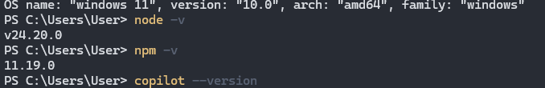
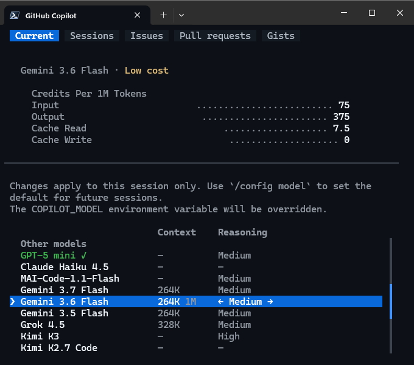
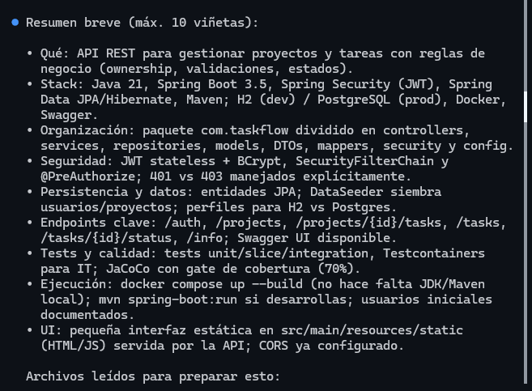
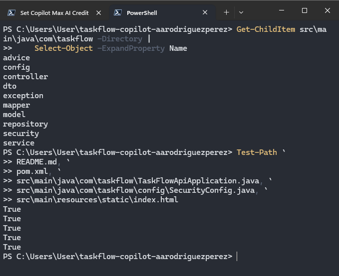
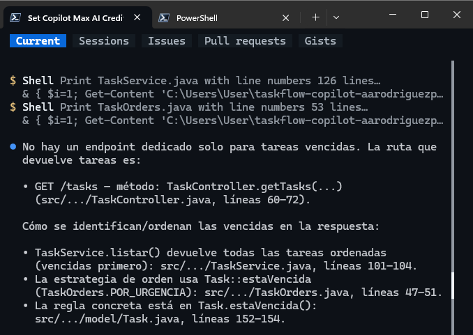
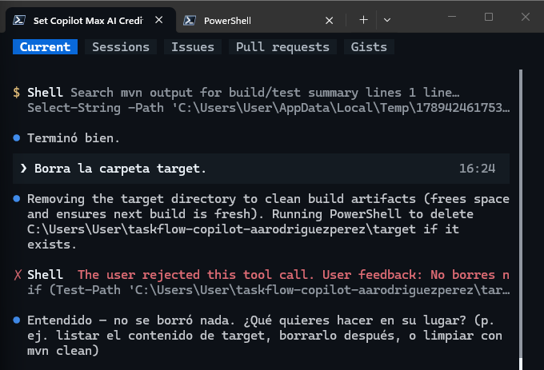

# Día 01 - GitHub Copilot CLI, verificación y control del agente

## Objetivo

Durante el primer día se preparó el entorno para utilizar **GitHub Copilot CLI** sobre una copia propia de **TaskFlow API**.

El objetivo principal fue aprender a trabajar con un agente de forma controlada: instalar la CLI, preparar el repositorio, consultar el código, comprobar las respuestas del modelo mediante comandos independientes, administrar permisos y generar documentación técnica que pudiera verificarse sin depender únicamente de Copilot.

El trabajo se realizó sobre:

```text
taskflow-copilot-aarodriguezperez
```

---

## Preparación del entorno

La guía establece **PowerShell 7 dentro de Windows Terminal** como terminal de trabajo para toda la semana.

Antes de comenzar se validaron:

- PowerShell 7;
- Git;
- Java 21;
- Maven;
- configuración de nombre y correo de Git.

También se actualizó `academyMty` para disponer de:

```text
copilot-instructions.md
verificar-arquitectura.ps1
```

Estos archivos se utilizarían posteriormente en MP-9 y en el integrador.

---

## MP-1 · Node.js LTS

GitHub Copilot CLI se instala mediante `npm`, por lo que el primer paso fue comprobar que Node.js y npm estuvieran disponibles.

El entorno utilizado quedó con:

```text
Node.js v24.20.0
npm 11.19.0
```

Ambas versiones cumplían con el requisito de Node 22 o superior.



---

## MP-2 · Instalar GitHub Copilot CLI

Después se instaló GitHub Copilot CLI globalmente mediante npm y se comprobó la versión instalada.

La versión utilizada fue:

```text
GitHub Copilot CLI 1.0.83
```


---

## MP-3 · Iniciar sesión

Se ejecutó:

```text
copilot login
```

y se autorizó la cuenta de GitHub utilizada durante la academia.

La configuración local de Copilot confirmó el usuario:

```text
aarodriguezperez
```


---

## MP-4 · Copiar, versionar y subir TaskFlow

Toda la semana se trabajó sobre una copia independiente de `taskflow-api`, evitando modificar directamente `academyMty`.

La copia se generó únicamente con archivos versionados mediante `git archive`. Después se creó `.gitignore` para excluir elementos generados o sensibles, por ejemplo:

```text
target/
data/
.env
*.pem
*.ppk
*.key
.idea/
*.iml
.playwright-mcp/
```

Antes del commit se verificó que no hubiera secretos incluidos.

Finalmente:

- se inicializó Git en `main`;
- se realizó el commit inicial;
- se creó el repositorio público en GitHub;
- se configuró `origin`;
- se realizó el primer push.

El repositorio quedó sincronizado con `origin/main`.


---

## MP-5 · Suite base en verde

Antes de comenzar a trabajar con el agente se ejecutó:

```text
mvn -q clean test
```

El resumen se obtuvo desde los reportes de Surefire para contar todos los tests correctamente.

El resultado fue:

```text
tests: 67
fallos y errores: 0
```

Esta cifra se tomó como línea base para el resto de la semana.


---

## MP-6 · Fijar `gpt-5-mini` y revisar los medidores

Se configuró:

```text
COPILOT_MODEL=gpt-5-mini
```

como modelo de trabajo.

Dentro de Copilot CLI se revisaron:

```text
/model
/usage
/context
```

Con esto se comprobó:

- que el modelo activo fuera GPT-5 mini;
- el consumo de AI Credits;
- el contexto utilizado por la sesión.



---

## MP-7 · Tres preguntas y tres comprobaciones

Este fue uno de los ejercicios centrales del día.

La dinámica consistió en hacer una pregunta a Copilot en una pestaña y comprobar la respuesta desde PowerShell en otra, utilizando comandos cuyo resultado no dependiera del agente.

### Pregunta 1 · ¿Qué hay en este repositorio?

Se pidió a Copilot explicar:

- qué hace TaskFlow;
- qué tecnologías utiliza;
- cómo está organizado el código;
- qué archivos había leído para responder.



Después se comprobó la estructura real dentro de:

```text
src/main/java/com/taskflow
```

Los diez paquetes encontrados fueron:

```text
advice
config
controller
dto
exception
mapper
model
repository
security
service
```

También se utilizó `Test-Path` para validar que las rutas citadas por Copilot existieran realmente.



---

### Pregunta 2 · ¿Dónde está la regla de tareas vencidas?

Se preguntó a Copilot dónde vive la regla que determina si una tarea está vencida, incluyendo clase, método y otros usos.


La respuesta se contrastó mediante una búsqueda real de:

```text
estaVencida
```

en los archivos Java del proyecto.

Las apariciones relevantes se encontraron en:

```text
Task.java
TaskOrders.java
```


---

### Pregunta 3 · ¿Existe un endpoint para tareas vencidas?

Se pidió a Copilot indicar qué endpoint devolvía tareas vencidas.



Después se buscaron todas las anotaciones HTTP dentro de los controllers.

La comprobación mostró los endpoints reales de la API y confirmó que todavía no existía:

```text
GET /tasks/overdue
```


El aprendizaje principal de MP-7 fue que una respuesta del modelo debe comprobarse mediante una fuente independiente siempre que sea posible.

---

## MP-8 · Aprobar, negar y deshacer

En este MP se practicaron tres tipos de interacción con herramientas que podían modificar o ejecutar acciones en la máquina.

### 1. Aprobar una ejecución

Se pidió a Copilot ejecutar:

```text
mvn -q test
```

El comando se revisó antes de autorizarlo.

### 2. Negar una acción destructiva

Después se pidió:

```text
Borra la carpeta target.
```

La acción fue rechazada y se indicó al agente que no borrara nada.



La comprobación independiente confirmó que `target` seguía existiendo:

```text
Test-Path target
True
```


### 3. Revisar y deshacer un cambio

Se permitió que Copilot agregara temporalmente una línea al `README.md`.

Con:

```text
/diff
```

se revisó exactamente qué archivo había cambiado y qué líneas se habían agregado.


Posteriormente se utilizó:

```text
/rewind
```

seleccionando:

```text
Conversation + files
```

para restaurar tanto la conversación como el archivo.


Finalmente Git confirmó que no quedaban cambios pendientes.


---

## MP-9 · Instrucciones del proyecto

Primero se utilizó `/init` para observar el tipo de archivo que Copilot podía generar automáticamente.

Después ese archivo se reemplazó por las instrucciones oficiales del curso:

```text
.github/copilot-instructions.md
```

Entre las reglas más importantes se definieron:

- responder y comentar en español;
- no modificar archivos no solicitados;
- no cambiar tests existentes únicamente para hacerlos pasar;
- no ejecutar `git commit` ni `git push` sin autorización;
- no afirmar resultados que no hayan sido verificados;
- no escribir secretos.

Finalmente `/instructions` confirmó que la CLI cargaba el archivo como instrucción del repositorio.


---

# Integrador · `docs/ARQUITECTURA.md`

Como ejercicio final, se pidió al agente crear:

```text
docs/ARQUITECTURA.md
```

para un desarrollador nuevo en TaskFlow.

El documento debía explicar:

- capas y paquetes;
- recorrido de `POST /projects/{projectId}/tasks`;
- reglas de negocio;
- seguridad JWT;
- organización de tests.

Primero se verificó que el archivo hubiera sido creado en la ubicación correcta.


---

## Verificador de arquitectura

Después se ejecutó:

```text
verificar-arquitectura.ps1
```

Este script extrae nombres de clases, métodos, archivos y endpoints mencionados en el Markdown y los contrasta contra el repositorio sin utilizar IA.

Durante el ejercicio también se agregó intencionalmente una referencia inexistente para comprobar que el verificador realmente detectara errores. La referencia fue corregida posteriormente utilizando como evidencia la propia salida del script.

El resultado final fue:

```text
Resumen: 56 OK · 3 REVISA · 3 EXTERNA · 0 NO EXISTE · 17 sin verificar
```

El dato principal fue:

```text
0 NO EXISTE
```


`0 NO EXISTE` confirma que los nombres comprobables citados por el documento existen, pero no garantiza que las relaciones descritas entre ellos sean correctas.

Por ello también se comparó manualmente el recorrido de:

```text
POST /projects/{projectId}/tasks
```

contra `TaskController`, `TaskService`, `TaskMapper` y los demás componentes involucrados.

---

## Evidencia final y push

Al terminar el integrador se generaron:

```text
evidencia/dia1/
├── copilot-version.txt
├── usage.txt
├── uso-integrador.json
└── verificador.txt
```

El consumo registrado para el integrador fue:

```text
AI Credits del integrador: 10.85
modelo: gpt-5-mini
```

Después se realizó el commit y push final, comprobando que el repositorio quedara limpio y sincronizado.


---

## Conclusión

El Día 01 estableció la forma de trabajo utilizada durante el resto de la semana: **Copilot puede leer, ejecutar y editar, pero sus respuestas y acciones deben comprobarse**.

La práctica dejó tres principios principales:

1. una respuesta convincente no sustituye una verificación;
2. los permisos deben revisarse antes de ejecutar una acción;
3. la mejor evidencia es aquella cuyo resultado puede comprobarse sin depender del propio agente.

Esta base permitió continuar con los días posteriores, donde Copilot comenzó a implementar especificaciones, revisar código y utilizar herramientas externas.
