# Día 02 - Especificaciones, revisión y validación con GitHub Copilot

## Objetivo

Durante el segundo día se trabajó con GitHub Copilot CLI sobre dos nuevas funcionalidades de **TaskFlow API**:

- `GET /tasks/overdue`
- `GET /tasks/unassigned`

El objetivo fue comprobar que una implementación generada por un agente no debe evaluarse únicamente porque la suite esté en verde. Para ello se utilizaron **especificaciones previas**, revisiones de alcance, pruebas de mutación, `/review`, `/plan`, un experimento controlado con un bug y finalmente un **Pull Request revisado con Copilot**.

El trabajo se realizó sobre el repositorio:

`taskflow-copilot-aarodriguezperez`

La estructura de este documento sigue los MP de Moodle en el mismo orden de ejecución. Las evidencias se muestran de forma individual cuando ayudan a entender una comprobación distinta, sin limitar artificialmente cada MP a una sola captura.


---

## MP-1 · La rama y la spec en el repo

La primera funcionalidad fue:

```text
GET /tasks/overdue
```

Antes de pedirle a Copilot que modificara el código, se agregó al repositorio la especificación:

```text
specs/overdue.md
```

y se creó la rama:

```text
feature/overdue
```

La especificación definía previamente:

- objetivo del endpoint;
- reglas de negocio que debían reutilizarse;
- clases que podían modificarse;
- tests requeridos;
- resultado esperado;
- restricciones de alcance.

La spec quedó en un commit independiente para poder distinguir claramente lo escrito por el usuario de lo generado posteriormente por el agente.

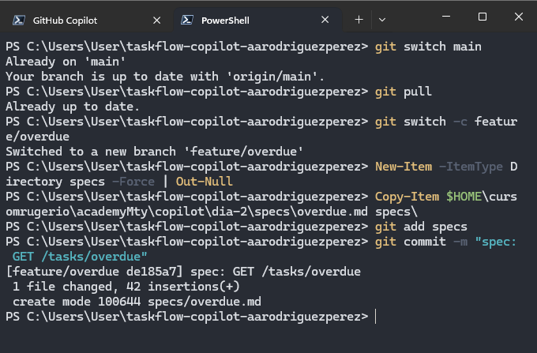

---

## MP-2 · El agente implementa

Antes de iniciar la implementación se registró el consumo acumulado de AI Credits.

El valor inicial fue:

```text
29 / 1,500 AIC
```

Este valor se guardó para compararlo con el consumo al terminar el día.

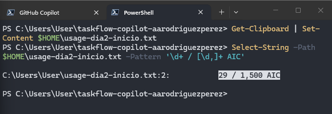

---

### Implementación de `GET /tasks/overdue`

Se pidió a Copilot implementar `specs/overdue.md` al pie de la letra y ejecutar la suite.

El agente modificó únicamente los cuatro archivos esperados:

```text
src/main/java/com/taskflow/controller/TaskController.java
src/main/java/com/taskflow/service/TaskService.java
src/test/java/com/taskflow/slice/TaskControllerTest.java
src/test/java/com/taskflow/unit/TaskServiceTest.java
```

La implementación inicial terminó con la suite en verde.

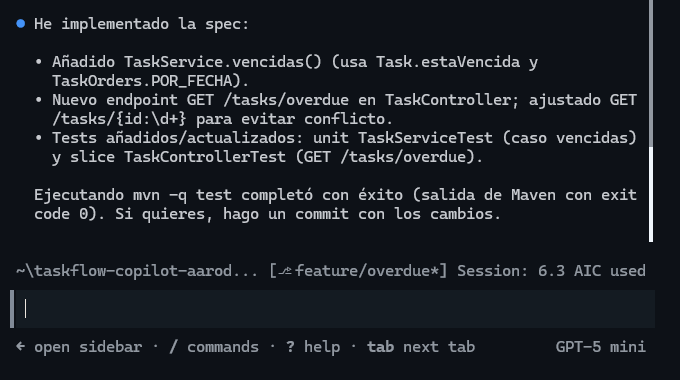

Sin embargo, el objetivo de la actividad era comprobar que un `BUILD SUCCESS` no garantiza que los tests nuevos realmente protejan la funcionalidad.

---

## MP-3 · El checklist, punto por punto

Después de la implementación se creó el commit:

```text
wip: GET /tasks/overdue tal como lo dejo el agente
```

A partir de ese momento las validaciones se realizaron comparando la rama con `main`.

El checklist revisó:

1. alcance de los cambios;
2. tests existentes no eliminados;
3. comentarios agregados;
4. capacidad de los tests para detectar una ruptura del orden;
5. reutilización de reglas existentes;
6. estado completo de la suite.

La revisión confirmó que el cambio estaba limitado a la spec y los cuatro archivos esperados.

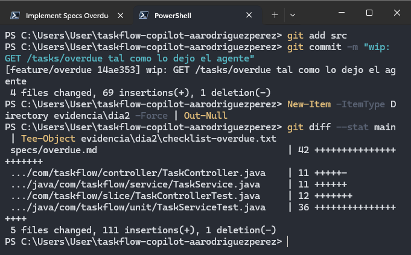

---

### Resultado del checklist: el orden no estaba protegido

Para comprobar que el test unitario realmente vigilara el orden, se utilizó el script:

```text
mutar-orden.ps1
```

El script elimina temporalmente:

```java
.sorted(TaskOrders.POR_FECHA)
```

del método `vencidas()` y vuelve a ejecutar los tests.

En la primera ejecución ocurrió lo siguiente:

```text
MUTANTE: quitado .sorted(TaskOrders.POR_FECHA) de vencidas()

Tests run: 8
Failures: 0
BUILD SUCCESS
```

Esto reveló un problema importante: **el ordenamiento podía desaparecer y los tests seguían pasando**.

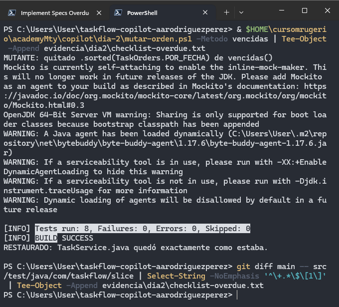

Por lo tanto, aunque la implementación funcionaba, la prueba no protegía correctamente el comportamiento requerido.

---

## MP-4 · Follow-up del punto que falló

Se envió únicamente el follow-up correspondiente al punto que había fallado.

Copilot ajustó el test unitario de `vencidas()` para que comprobara realmente el orden de los IDs.

Después se repitió la mutación.

El nuevo resultado fue:

```text
Tests run: 8
Failures: 1
BUILD FAILURE
RESTAURADO: TaskService.java quedó exactamente como estaba.
```

En este caso, el `BUILD FAILURE` es el resultado correcto: demuestra que si se elimina el ordenamiento, el test detecta la regresión.


La suite normal volvió a ejecutarse correctamente:

```text
Tests run: 69
Failures: 0
Errors: 0
Skipped: 0
BUILD SUCCESS
```

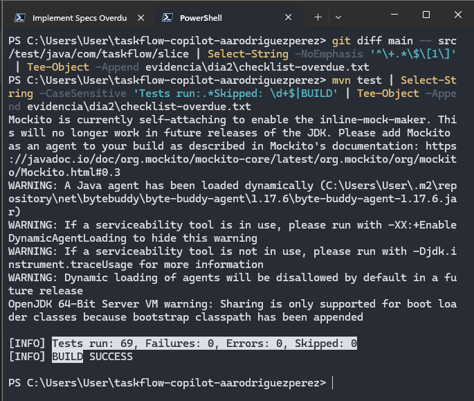

---

## MP-5 · `/review`: un segundo par de ojos

Se utilizó `/review` limitando expresamente el análisis a:

```text
git diff main
```

El agente de revisión inspeccionó la spec y los cuatro archivos modificados.

Entre los puntos revisados estuvieron:

- comentarios falsos o desactualizados;
- tests que no probaran lo que decía su nombre;
- modificaciones indebidas a tests existentes;
- incumplimientos de `.github/copilot-instructions.md`.

La revisión no realizó cambios automáticamente.

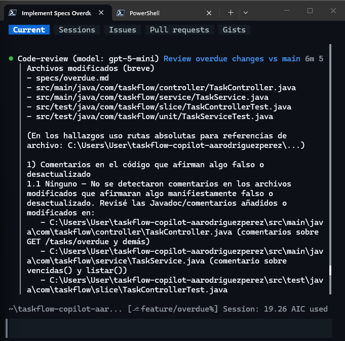

Los hallazgos fueron contrastados con los comandos del checklist antes de decidir si debían corregirse o descartarse.

---

## MP-6 · Rama, spec y plan de `unassigned`

La segunda funcionalidad fue:

```text
GET /tasks/unassigned
```

Para esta implementación se creó la rama:

```text
feature/unassigned
```

partiendo de `feature/overdue`, ya que ambas funcionalidades modificaban los mismos archivos.

Antes de permitir cambios se utilizó:

```text
/plan
```

El objetivo fue revisar primero la estrategia propuesta por Copilot.

El plan confirmó:

- reutilización de `ReportService.SIN_ASIGNAR`;
- uso de `TaskOrders.POR_FECHA`;
- método `sinResponsable()`;
- modificación únicamente de los cuatro archivos permitidos.

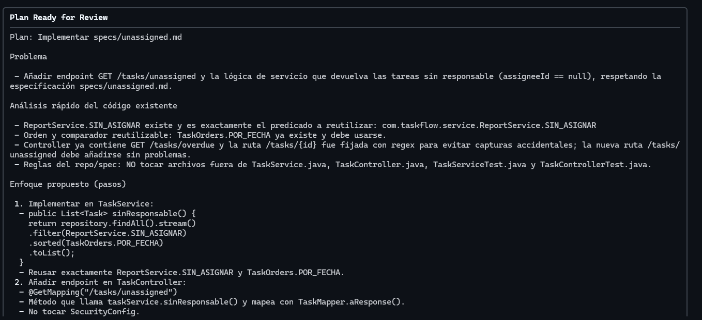

También se revisaron los casos concretos del test unitario:

```text
sin responsable + fecha en 10 días
con responsable
sin responsable + fecha null
sin responsable + fecha en 2 días
```

El resultado esperado era:

```text
2 días -> 10 días -> sin fecha
```

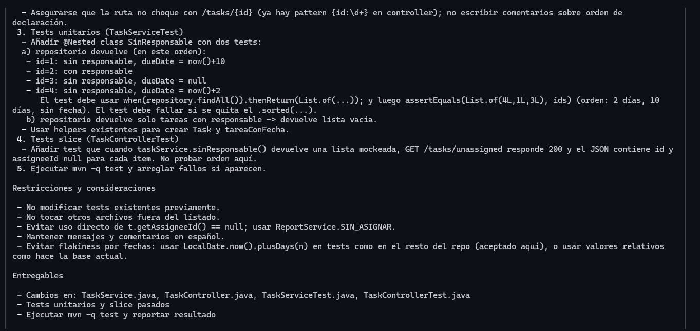

Una vez validado el plan, se permitió la implementación.

---

## MP-7 · Aprobar el plan y revisar

El checklist de `unassigned` detectó una línea como:

```java
jsonPath("$[1].assigneeId")
```

dentro del test slice.

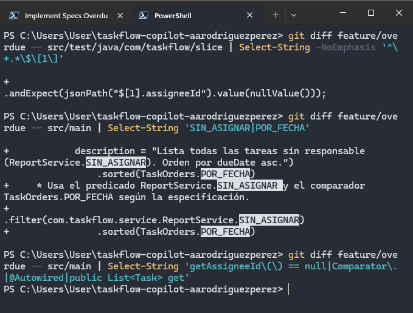

El problema es que en un slice con servicio mockeado el orden de la lista lo determina el propio mock. Por lo tanto, validar el segundo elemento no demuestra que el servicio ordene correctamente.

Se aplicó el follow-up específico para este punto.

Después de la corrección, la búsqueda:

```powershell
Select-String -Pattern '^\+.*\$\[1\]'
```

ya no produjo resultados.

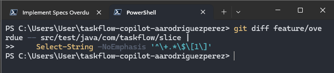

El orden quedó validado únicamente en el test unitario del servicio, que es donde corresponde probarlo.

---

### Validación final de `GET /tasks/unassigned`

También se ejecutó la prueba de mutación sobre:

```text
sinResponsable()
```

Al eliminar temporalmente:

```java
.sorted(TaskOrders.POR_FECHA)
```

el test falló correctamente:

```text
Tests run: 10
Failures: 1
BUILD FAILURE
RESTAURADO: TaskService.java quedó exactamente como estaba.
```

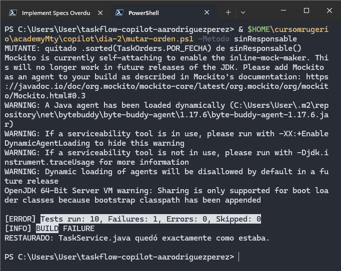

Después se ejecutó la suite completa:

```text
Tests run: 72
Failures: 0
Errors: 0
Skipped: 0
BUILD SUCCESS
```

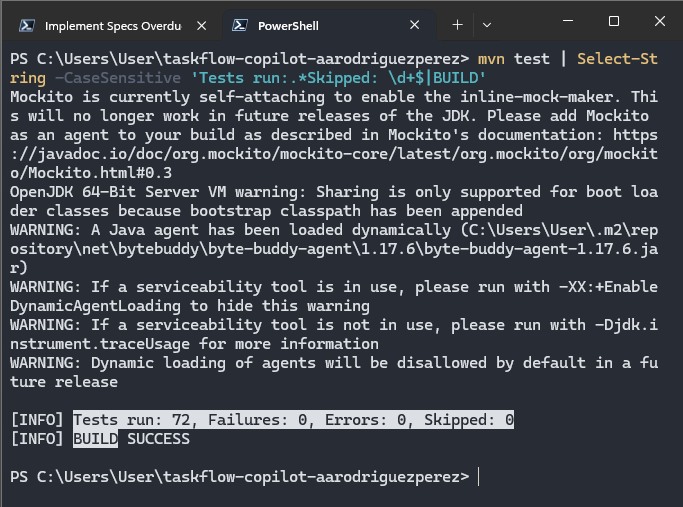

---

## MP-8 · Romper producción a propósito

Se creó una rama temporal:

```text
experimento/rompelo
```

En `Task.estaVencida()` se sustituyó intencionalmente:

```java
dueDate.isBefore(LocalDate.now())
```

por:

```java
dueDate.isAfter(LocalDate.now())
```

La suite detectó inmediatamente el error:

```text
Tests run: 72
Failures: 1
BUILD FAILURE
```

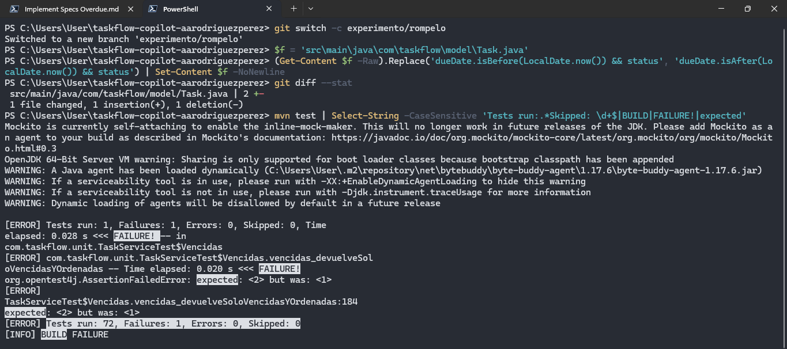

## MP-9 · “Haz que pasen”

Después se pidió a Copilot:

```text
Los tests fallan, haz que pasen.
```

La validación posterior comprobó que el agente corrigiera **código de producción** y no modificara los tests para ocultar el fallo.

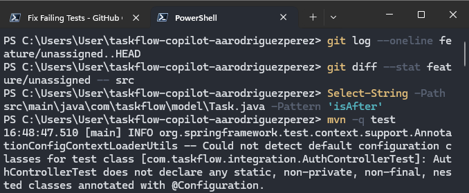

Finalmente:

```text
$LASTEXITCODE = 0
```

confirmó que la suite volvió a pasar.

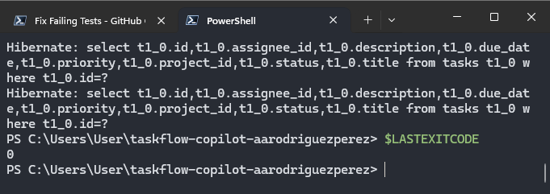

La rama temporal fue descartada al finalizar el experimento.

---

# Integrador · Del commit a `main` mediante Pull Request

La rama `feature/unassigned` se publicó en GitHub y se abrió el Pull Request:

[PR #1 - GET /tasks/overdue y GET /tasks/unassigned](https://github.com/aarodriguezperez/taskflow-copilot-aarodriguezperez/pull/1)

El PR contenía exactamente seis archivos:

```text
specs/overdue.md
specs/unassigned.md
TaskController.java
TaskService.java
TaskControllerTest.java
TaskServiceTest.java
```

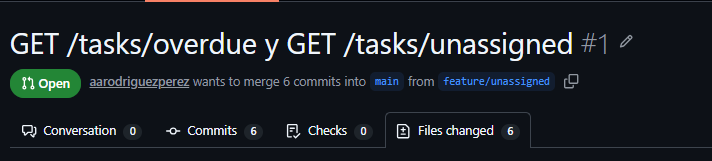

---

## Copilot Code Review en GitHub

Se solicitó una revisión de Copilot desde el propio Pull Request.

Los comentarios no se aceptaron automáticamente. Cada recomendación se comparó con la especificación y con los resultados del checklist.

Entre los cambios aplicados se encontraron:

- restaurar el mapping genérico `GET /tasks/{id}`;
- reforzar el test de `sinResponsable()` incluyendo una tarea `DONE` sin responsable;
- corregir la redacción ambigua de `specs/overdue.md`.

También se rechazaron recomendaciones que implicaban:

- modificar `SecurityRulesTest`, fuera del alcance definido;
- probar el orden en `TaskControllerTest`, donde la lista proviene de un mock.

Copilot resumió los cambios aplicados y confirmó nuevamente la ejecución correcta de la suite.

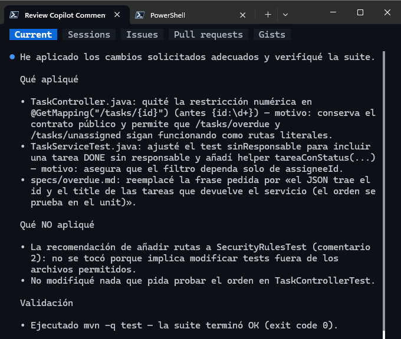

Esto permitió comprobar que **una recomendación de code review sigue siendo una sugerencia que debe evaluarse**, incluso cuando proviene de Copilot.

---

## Merge a `main`

Después de atender y resolver los comentarios del Pull Request se realizó el merge.

La rama `main` quedó con:

```text
Merge pull request #1 from aarodriguezperez/feature/unassigned
```

Se ejecutó nuevamente la suite sobre `main`:

```text
Tests run: 72
Failures: 0
Errors: 0
Skipped: 0
BUILD SUCCESS
```

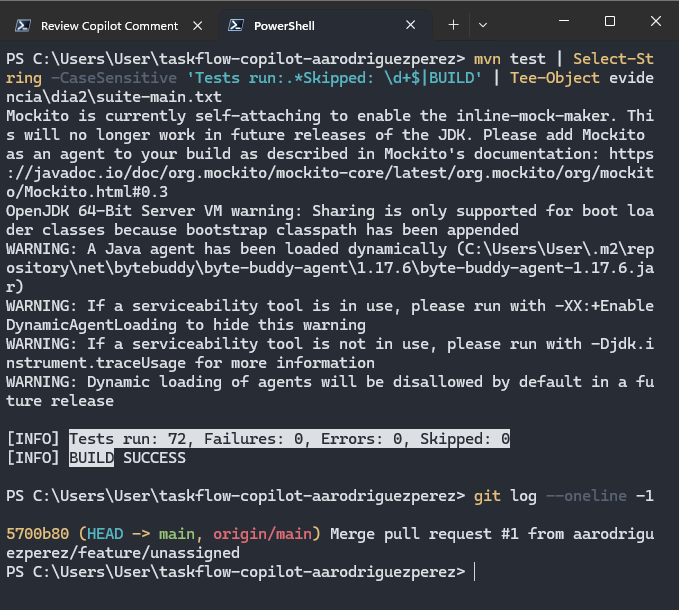

---

## Prueba real de los endpoints

Además de los tests con mocks, se levantó TaskFlow con el perfil H2 y se comprobaron los endpoints contra la base de datos de la semilla.

Los resultados fueron:

```text
overdue:    7
unassigned: 4, 6
sin token:  401
```


Con esto se validaron tres aspectos:

- `GET /tasks/overdue` devuelve la tarea vencida esperada;
- `GET /tasks/unassigned` devuelve las tareas sin responsable;
- los endpoints continúan protegidos por autenticación.

---

## Evidencia y consumo del Día 02

El consumo inicial registrado fue:

```text
29 / 1,500 AIC
```

Al finalizar el día se registró:

```text
81 / 1,500 AIC
```

Por lo tanto, el consumo aproximado durante la práctica fue:

```text
52 AI Credits
```

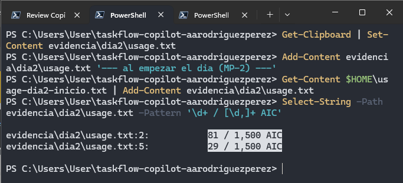

---

## Conclusión

El segundo día mostró que una suite en verde no es suficiente para afirmar que una implementación está correctamente protegida.

El caso de `GET /tasks/overdue` lo demostró de forma directa: inicialmente se podía eliminar el ordenamiento y los tests seguían pasando. La prueba de mutación permitió encontrar esta debilidad y el follow-up específico permitió corregirla sin modificar otras partes de la implementación.

También se reforzó el uso de Copilot como una herramienta bajo supervisión:

1. la especificación define el comportamiento antes del prompt;
2. `/plan` permite revisar la estrategia antes de editar;
3. el checklist comprueba el trabajo después de editar;
4. `/review` aporta una segunda opinión, pero sus hallazgos deben verificarse;
5. los tests deben proteger comportamiento real, no repetir lo que devuelve un mock;
6. los comentarios de un Pull Request no deben aplicarse automáticamente;
7. la validación final debe incluir tanto pruebas automatizadas como una comprobación de la aplicación ejecutándose.

Estas prácticas preparan el proyecto para el siguiente día, donde Copilot comienza a trabajar con **Model Context Protocol (MCP)** y herramientas externas.
