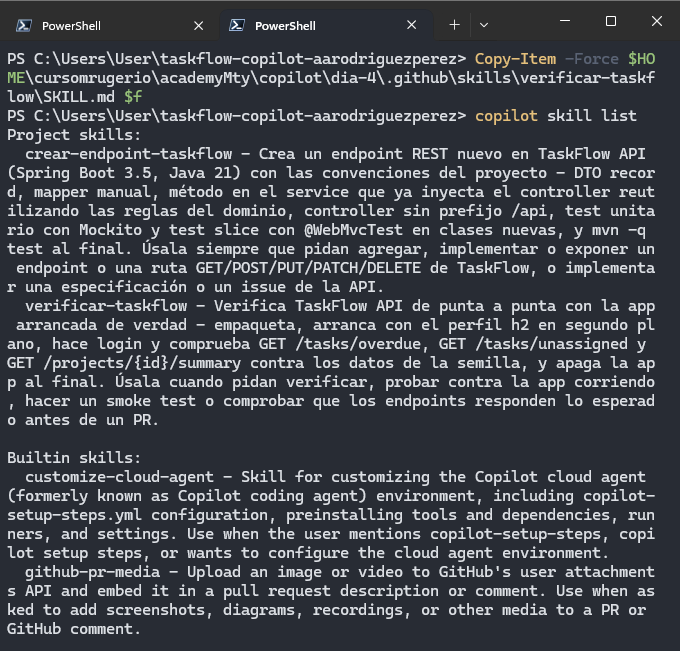
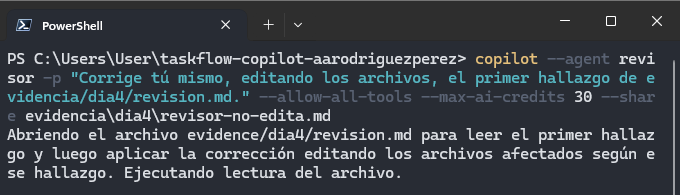
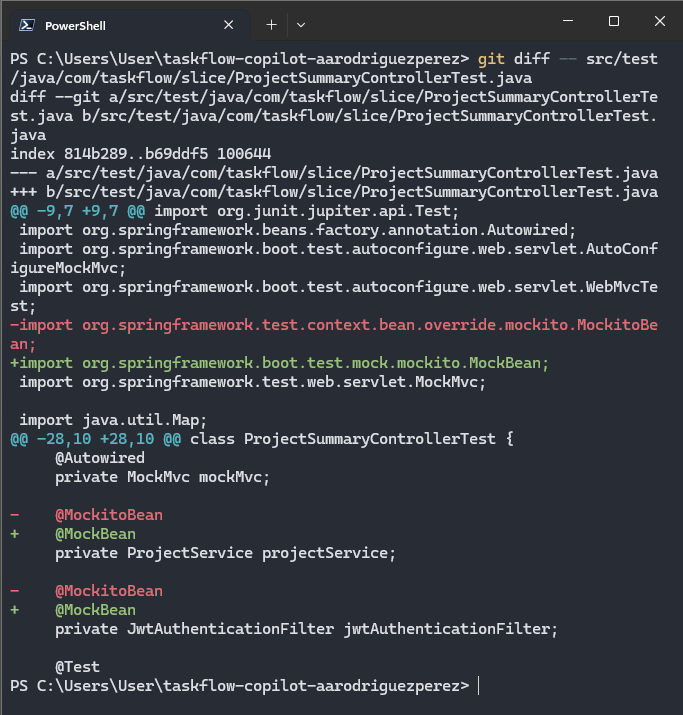
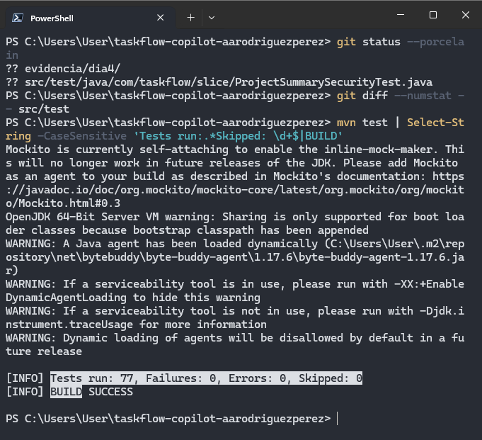
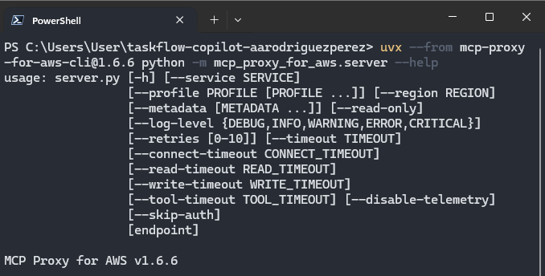
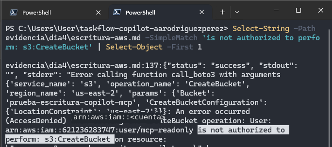
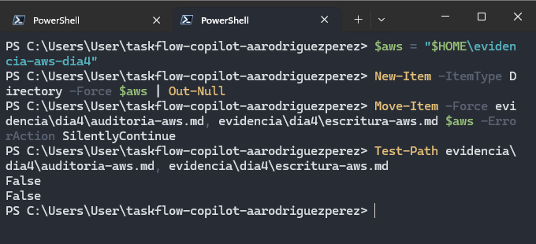
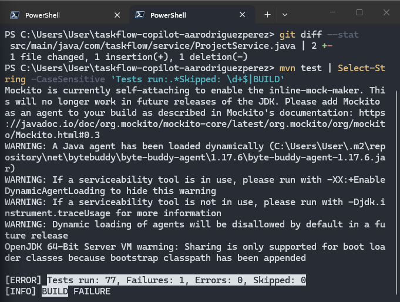
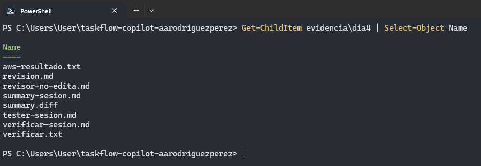

# Día 04 - Skills, agentes personalizados y auditoría controlada

## Objetivo

Durante el Día 04 se trabajó con **skills**, **agentes personalizados** y servidores **MCP** para organizar el uso de GitHub Copilot CLI por responsabilidades.

Los objetivos principales fueron:

- implementar `GET /projects/{id}/summary` mediante una skill;
- verificar la implementación con una segunda skill y una prueba de punta a punta;
- separar revisión y testing mediante agentes personalizados;
- comprobar que las herramientas disponibles realmente limitan lo que un agente puede hacer;
- auditar una cuenta de AWS con credenciales de solo lectura;
- introducir un error de negocio a propósito y comprobar que el equipo de verificación lo detectara.

El trabajo se realizó sobre:

```text
taskflow-copilot-aarodriguezperez
```

en la rama:

```text
dia4-equipo
```

---

# Preparación del Día 04

Antes de iniciar se actualizó `academyMty` y se comprobó que estuvieran disponibles las skills, agentes, scripts y archivos de referencia del día.

También se validó que:

- `main` contuviera `GET /tasks/overdue` y `GET /tasks/unassigned`;
- la suite estuviera en verde;
- el issue `#2 - GET /projects/{id}/summary` siguiera disponible;
- `gpt-5-mini` continuara configurado;
- GitHub Copilot CLI estuviera actualizado.

Los servidores MCP utilizados durante el Día 03 se deshabilitaron temporalmente para evitar cargar herramientas innecesarias:

```text
taskflow
playwright
aws-knowledge
```

Después se creó:

```text
dia4-equipo
```

y se agregó:

```text
specs/summary.md
```

a partir de la especificación del issue del Día 03.


---

# Skills: recetas que el agente carga cuando las necesita

## MP-1 · Agregar las skills al proyecto

Se incorporaron:

```text
.github/skills/crear-endpoint-taskflow/
.github/skills/verificar-taskflow/
```

La primera contiene una receta reutilizable para implementar endpoints dentro de TaskFlow y la segunda incluye un script de verificación de punta a punta.

Con:

```text
copilot skill list
```

se confirmó que ambas aparecieran como **Project skills**.


---

## MP-2 · Romper el frontmatter de una skill

Se modificó temporalmente:

```text
.github/skills/verificar-taskflow/SKILL.md
```

eliminando la primera línea del frontmatter.

La skill dejó de cargarse y Copilot reportó:

```text
missing or malformed YAML frontmatter
```



Después se restauró el archivo original y ambas skills volvieron a aparecer correctamente.

---

## MP-3 · Implementar `GET /projects/{id}/summary`

La implementación se solicitó invocando explícitamente:

```text
/crear-endpoint-taskflow
```

sobre:

```text
specs/summary.md
```

La skill establecía reglas adicionales a las instrucciones generales del repositorio, entre ellas:

- crear los tests nuevos en clases nuevas;
- utilizar el service que el controller ya inyectaba;
- leer `plantillas.md` antes de escribir;
- reutilizar reglas y convenciones existentes.

Después de la ejecución se comprobó el resultado sin depender de la explicación del modelo.

La suite pasó de **72 a 76 tests**:

```text
Tests run: 76
Failures: 0
Errors: 0
Skipped: 0
BUILD SUCCESS
```

Los tests generados aparecieron como archivos nuevos y no como modificaciones de tests existentes.


---

## MP-4 · Comprobar que la skill realmente se cargó

Un resultado parecido a la receta no demuestra que Copilot haya utilizado la skill.

Por ello se revisó:

```text
evidencia/dia4/summary-sesion.md
```

y se buscó:

```text
Skill "crear-endpoint-taskflow" loaded successfully
```

La llamada apareció correctamente en el transcript.


Antes del commit se eliminaron del transcript las contraseñas temporales generadas por Spring Security.

---

# Skill con script: `verificar-taskflow`

## MP-5 · Ejecutar el script manualmente

La skill:

```text
verificar-taskflow
```

incluye:

```text
.github/skills/verificar-taskflow/verificar.ps1
```

El script:

1. empaqueta TaskFlow;
2. arranca la aplicación con H2;
3. espera a que la API y la semilla estén disponibles;
4. ejecuta peticiones reales;
5. apaga la aplicación al terminar.

Se comprobaron:

```text
GET /tasks/overdue
GET /tasks/unassigned
GET /projects/1/summary
GET /projects/2/summary
GET /projects/3/summary
404 de proyecto inexistente
401 sin token
apagado de la aplicación
```

El resultado fue:

```text
RESULTADO: 8/8 OK
```


---

## MP-6 · Pedir a Copilot que ejecute la skill

Después se solicitó:

```text
/verificar-taskflow Verifica TaskFlow con el script de la skill y dame el resultado.
```

Copilot cargó la skill y ejecutó el script.


Posteriormente se revisó el transcript buscando el resultado acompañado por la salida real del shell.

La comprobación mostró:

```text
RESULTADO: 8/8 OK
<shellId: ... completed with exit code 0>
```


La segunda evidencia es importante porque distingue la salida del comando de una posible repetición realizada por el modelo.

---

# Agentes personalizados: roles con herramientas diferentes

## MP-7 · Crear el equipo

Se incorporaron:

```text
.github/agents/revisor.agent.md
.github/agents/tester.agent.md
```

Los dos roles quedaron diferenciados de la siguiente forma:

| Agente | Herramientas | Responsabilidad |
| --- | --- | --- |
| `revisor` | `read`, `search` | revisar sin modificar |
| `tester` | `read`, `search`, `edit`, `execute` | agregar tests y ejecutar Maven |

Al utilizar `/agent`, ambos aparecieron como agentes personalizados del proyecto.


---

## MP-8 · Revisar la implementación con `revisor`

Como `revisor` no puede ejecutar Git, primero se generó:

```text
evidencia/dia4/summary.diff
```

y se pidió comparar ese diff contra:

```text
specs/summary.md
```

El agente produjo:

- hallazgos;
- sugerencias;
- sección **Casos sin test**;
- veredicto.


Después se ejecutaron comprobaciones independientes.

`Select-String` encontró las secciones esperadas y:

```text
git status --porcelain src
```

no mostró cambios.


---

## MP-9 · Pedir al revisor que edite

Para comprobar que la lista de herramientas era una restricción real, el agente se ejecutó con:

```text
--allow-all-tools
```

y se le pidió corregir directamente su primer hallazgo.

El agente intentó resolver la tarea desde su rol:



Sin embargo:

```text
git status --porcelain -- src .github
```

no mostró ninguna modificación.

El transcript sí existía, pero los archivos permanecieron iguales.


Esto demostró que `--allow-all-tools` no puede proporcionar una herramienta que el agente no tiene declarada.

---

## MP-10 · El tester agrega los casos faltantes

El agente `tester` recibió:

- `specs/summary.md`;
- **Casos sin test** de `revision.md`;
- los tests actuales de `summary`.

Durante la primera revisión se encontró que había modificado anotaciones dentro de `ProjectSummaryControllerTest`.



Ese cambio no era necesario para agregar el caso faltante, por lo que se restauró.

Al terminar, `git status` mostró únicamente:

```text
src/test/java/com/taskflow/slice/ProjectSummarySecurityTest.java
```

como test nuevo, y `git diff --numstat -- src/test` ya no reportó modificaciones a tests existentes.

La suite terminó en:

```text
Tests run: 77
Failures: 0
Errors: 0
Skipped: 0
BUILD SUCCESS
```



---

# Auditoría de AWS con un agente de solo lectura

## MP-11 · Crear `mcp-readonly`

Para revisar la cuenta utilizada durante la Semana 05 se creó temporalmente:

```text
mcp-readonly
```

con la política:

```text
ViewOnlyAccess
```

Se configuró el perfil local:

```text
mcp-readonly
```

y se validó mediante:

```text
aws sts get-caller-identity --profile mcp-readonly
```

La evidencia utilizada para documentación fue recortada y anonimizada: **no contiene Access Key, Secret Access Key ni número de cuenta**.


La capa principal de protección era IAM: aunque el agente recibiera permisos amplios en Copilot, la identidad de AWS no debía poder escribir.

---

## MP-12 · Preparar `auditor-aws` y `limpieza-aws`

El servidor de AWS se ejecuta mediante `uvx`.

Se comprobó la versión fija utilizada en la práctica:

```text
MCP Proxy for AWS v1.6.6
```



Después se incorporaron:

```text
.github/agents/auditor-aws.agent.md
.github/skills/limpieza-aws/
```

`copilot skill list` mostró las tres skills del proyecto:

```text
crear-endpoint-taskflow
limpieza-aws
verificar-taskflow
```


El agente `auditor-aws` declara internamente el servidor `aws-ro`, por lo que AWS solo queda disponible dentro de ese rol.

---

## MP-13 · Auditar la cuenta y comprobar que no puede escribir

Después de resolver la configuración del perfil, el agente realizó la llamada real:

```text
aws-ro-aws___run_script
```

y el transcript produjo:

```text
Veredicto: CUENTA LIMPIA
```


### Prueba de escritura

La segunda parte del MP pidió intentar una única operación:

```text
s3:CreateBucket
```

AWS rechazó la llamada:

```text
AccessDenied
mcp-readonly is not authorized to perform: s3:CreateBucket
```

La captura fue anonimizada para no publicar el número de cuenta.



Esto comprobó que la restricción no dependía únicamente de las instrucciones del agente: **AWS impedía la escritura en la capa de IAM**.

### Sacar los transcripts privados del repositorio

Los transcripts completos contenían identificadores de cuenta y recursos, por lo que se movieron a:

```text
$HOME\evidencia-aws-dia4
```

fuera del repositorio público.

`Test-Path` confirmó:

```text
False
False
```

para los dos transcripts dentro de `evidencia/dia4/`.



En el repo solo permaneció:

```text
aws-resultado.txt
```

con la información anonimizada.

---

# Integrador · El equipo debe detectar un error

## 1. Romper la regla a propósito

La implementación correcta del resumen reutilizaba:

```java
Task::estaVencida
```

La regla fue reemplazada temporalmente por una condición que solo revisaba `dueDate`, ignorando el estado `DONE`.

En este recorrido, la suite ya contenía el test agregado por el agente tester, por lo que también detectó el error:

```text
Tests run: 77
Failures: 1
BUILD FAILURE
```



Además se ejecutó la comprobación de punta a punta.

Contra la semilla real, el resultado fue:

```text
RESULTADO: 2 de 8 con FALLA
```


Así se comprobó el mismo defecto desde dos niveles distintos: tests automatizados y aplicación ejecutándose.

---

## 2. Restaurar la implementación

La versión correcta se restauró y se volvió a ejecutar:

```text
verificar.ps1
```

El resultado regresó a:

```text
RESULTADO: 8/8 OK
```


Antes de publicar la rama se comprobó que no quedaran modificaciones accidentales dentro de `src`.

---

# Pull Request y merge

Antes de publicar se buscaron:

- Access Keys;
- Secret Access Keys;
- contraseñas temporales;
- ARN con números de cuenta.

Después se publicó:

```text
dia4-equipo
```

y se abrió:

```text
#4 - GET /projects/{id}/summary con el equipo de .github
```

El PR se mergeó a:

```text
main
```


Una vez actualizado `main`, `copilot skill list` confirmó que las skills del proyecto seguían disponibles después del merge.


---

# Cierre del issue

La funcionalidad implementada correspondía a:

```text
#2 - GET /projects/{id}/summary
```

Al finalizar quedó en estado:

```text
Closed
```


---

# Evidencia final

El directorio del Día 04 quedó con:

```text
aws-resultado.txt
revision.md
revisor-no-edita.md
summary-sesion.md
summary.diff
tester-sesion.md
verificar-sesion.md
verificar.txt
```



Los transcripts completos de AWS no permanecieron dentro del repositorio.

---

# Limpieza

Al terminar se restauró la configuración utilizada durante el Día 03 y se eliminaron las credenciales temporales utilizadas para AWS.

Los servidores:

```text
taskflow
playwright
aws-knowledge
```

se volvieron a habilitar.

También se eliminó:

```text
mcp-readonly
```

junto con:

- su Access Key;
- `ViewOnlyAccess`;
- el perfil `[mcp-readonly]`;
- el bloque `[profile mcp-readonly]`.

De esta forma, una credencial creada únicamente para la práctica no continuó activa después de terminar el día.

---

# Conclusión

El Día 04 reunió los conceptos trabajados durante la semana y los organizó dentro de `.github/`.

Las cuatro piezas principales quedaron diferenciadas:

| Mecanismo | Función |
| --- | --- |
| `.github/copilot-instructions.md` | reglas generales del repositorio |
| Skill | receta reutilizable para una tarea concreta |
| Agente personalizado | rol con instrucciones y herramientas específicas |
| Servidor MCP | capacidad externa accesible mediante herramientas |

La práctica también mostró que las restricciones deben aplicarse en capas.

El agente `revisor` no podía modificar código porque no tenía herramientas de edición. El agente `auditor-aws` podía interactuar con AWS, pero IAM impedía las operaciones de escritura aunque Copilot se iniciara con permisos amplios.

Finalmente, el integrador confirmó el valor de las verificaciones independientes: al introducir una regla incorrecta, tanto la suite como `verificar-taskflow` detectaron el problema, y la restauración volvió a dejar la aplicación en `8/8 OK`.
