# Día 05 - VS Code, MCP y proyecto final con GitHub Copilot

## Objetivo

Durante el Día 05 se utilizó el mismo repositorio de TaskFlow desde **Visual Studio Code** para comprobar que las instrucciones, skills, agentes y servidores MCP construidos durante la semana también podían utilizarse desde el editor.

La mañana se enfocó en:

- instalar y configurar VS Code;
- utilizar autocompletado en línea;
- comparar los modos **Ask** y **Agent**;
- comprobar las instrucciones, skills y agentes del proyecto desde el editor;
- configurar los servidores MCP mediante `.vscode/mcp.json`;
- utilizar el servidor MCP propio de TaskFlow desde Copilot Chat.

Por la tarde se realizó el **proyecto final**, siguiendo el flujo:

```text
rama
→ spec
→ skill
→ tests
→ agente revisor
→ verificación REST
→ Pull Request
→ Copilot Code Review
→ merge
→ semana6/README.md
```

La feature elegida fue:

```text
GET /reports/progress
```

---

# Preparación del Día 05

Antes de trabajar en VS Code se actualizó `academyMty` y se ejecutó la checklist de entrada sobre el repositorio.

Se comprobó la existencia de los elementos construidos durante los días anteriores:

```text
.github/copilot-instructions.md
taskflow-mcp/target/taskflow-mcp.jar
.github/skills/crear-endpoint-taskflow/SKILL.md
.github/skills/verificar-taskflow/verificar.ps1
.github/agents/revisor.agent.md
.github/agents/tester.agent.md
```

También se validaron:

```text
GitHub Copilot CLI >= 1.0.83
COPILOT_MODEL = gpt-5-mini
```

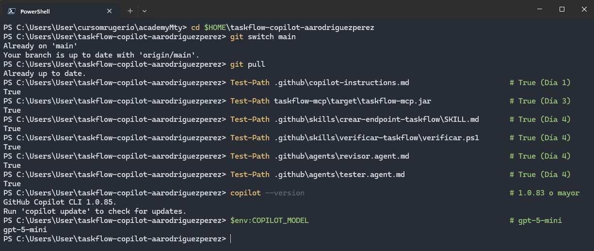

La configuración de subagentes conservaba los tres valores `inherit` y la suite inicial quedó en:

```text
Tests run: 77
Failures: 0
Errors: 0
Skipped: 0
BUILD SUCCESS
```

Este fue el punto de partida utilizado posteriormente para comprobar que la feature del proyecto final agregara cobertura.

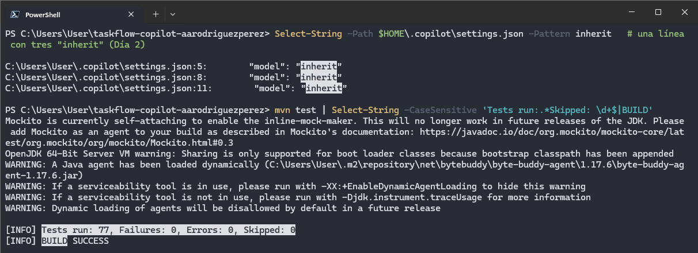

---

# VS Code

## MP-1 · Instalar y comprobar VS Code

Se instaló Visual Studio Code mediante `winget` y se comprobó:

```text
code --version
```

También se verificó que GitHub Copilot Chat estuviera disponible dentro de la instalación.

La versión utilizada cumplía el requisito de la guía.

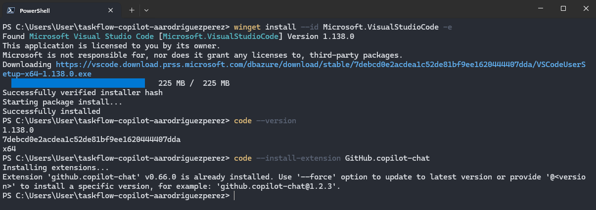

---

## MP-2 · Abrir el repositorio e iniciar sesión

El repositorio se abrió mediante:

```text
code .
```

Dentro de VS Code se confirmó que la sesión de GitHub correspondiera al usuario utilizado durante la academia.

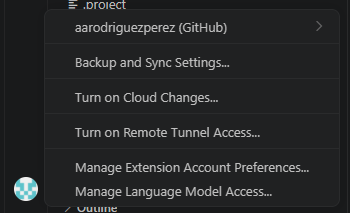

El menú de Copilot mostró el plan activo y el porcentaje de créditos utilizados, confirmando que la autenticación con GitHub Copilot había terminado correctamente.

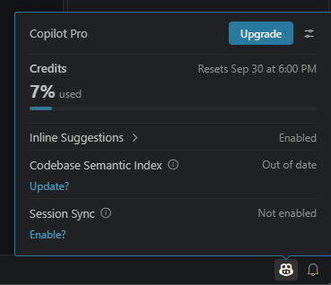

---

# Autocompletado

## MP-3 · Texto fantasma en `TaskService`

Se abrió:

```text
TaskService.java
```

y se escribió la firma:

```java
public List<Task> porPrioridadPorFecha(Priority priority) {
```

Copilot propuso el cuerpo del método a partir del código cercano.

Durante el ejercicio se practicaron dos acciones distintas:

- `Esc` para rechazar una sugerencia;
- `Tab` para aceptar una sugerencia completa.

La implementación aceptada reutilizó:

```java
TaskOrders.POR_FECHA
```

y mantuvo el estilo del método existente.


El código solo era una prueba de autocompletado, por lo que después se restauró:

```text
TaskService.java
```

y `git status --porcelain` volvió a quedar vacío.

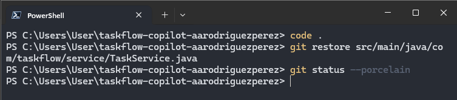

---

# Chat: Ask y Agent

## MP-4 · Consultar el repositorio con Ask

Se abrió Copilot Chat en una sesión local con:

```text
Ask
GPT-5 mini
Default permissions
```

y se preguntó:

```text
¿Qué hace Task.estaVencida() y qué métodos del proyecto la usan?
Cita archivo y línea.
```

Copilot localizó la regla de vencimiento y sus usos dentro del proyecto.

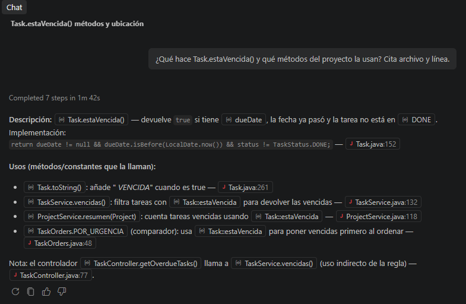

Al igual que durante el Día 01, la respuesta se comprobó de forma independiente con `Select-String`.

La búsqueda mostró las apariciones reales de:

```text
estaVencida
```

dentro del código y los tests.


---

## MP-5 · Ejecutar una acción con Agent y aprobarla

Después se cambió el modo del chat a:

```text
Agent
```

y se pidió:

```text
Corre mvn -q test en la terminal y dime si la suite pasó.
No modifiques ningún archivo.
```

Con **Default permissions**, VS Code mostró el comando antes de ejecutarlo y esperó autorización.

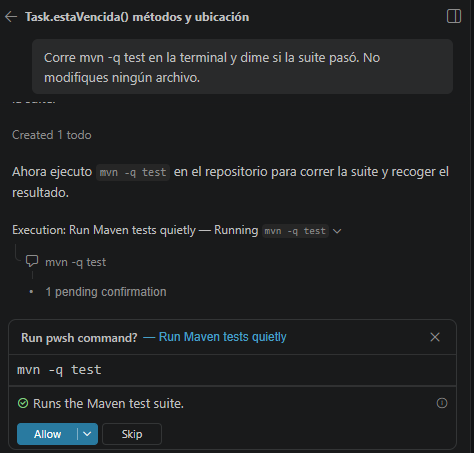

Después de aprobarlo, el agente confirmó que Maven terminó correctamente con código de salida `0`.

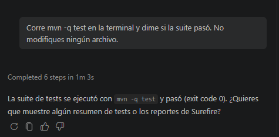

Finalmente:

```text
git status --porcelain
```

no mostró cambios, por lo que la ejecución no modificó archivos.

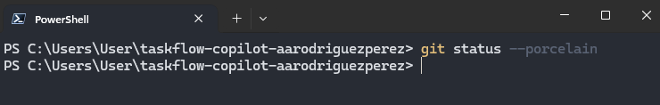

---

# `.github/` dentro de VS Code

## MP-6 · Instrucciones del proyecto

Desde VS Code se comprobó que el archivo:

```text
.github/copilot-instructions.md
```

fuera reconocido como instrucción del proyecto.

El selector de instrucciones mostró `copilot-instructions` dentro del workspace.

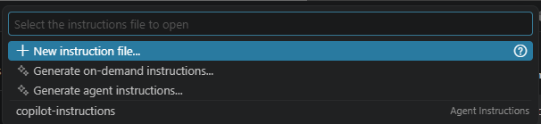

Esto confirmó que las reglas creadas durante el Día 01 también estaban disponibles desde el editor.

---

## MP-7 · Skills del proyecto

Se abrió el selector de skills de VS Code.

Las skills disponibles incluían:

```text
crear-endpoint-taskflow
limpieza-aws
verificar-taskflow
```

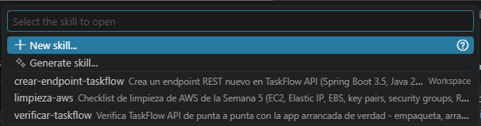

La misma estructura `.github/skills/` utilizada por la CLI pudo reutilizarse desde el editor.

---

## MP-8 · Agentes personalizados

También se probó el rol `revisor` desde VS Code.

Se le pidió agregar un comentario al inicio de `TaskService.java`.

El agente explicó que no podía modificar archivos desde ese modo y únicamente indicó qué línea podría agregarse.

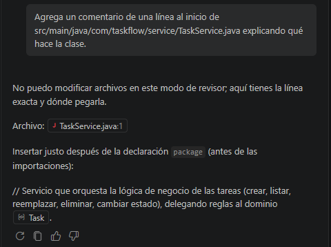

Después se comprobó:

```text
git status --porcelain
```

y no apareció ninguna modificación.

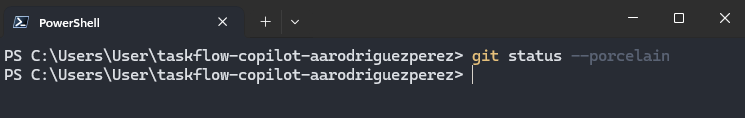

La prueba volvió a demostrar que las herramientas declaradas para un agente funcionan como una restricción efectiva.

---

# MCP en VS Code

## MP-9 · Configurar los servidores en `.vscode/mcp.json`

La CLI y VS Code utilizan archivos MCP distintos.

Para VS Code se copió:

```text
.vscode/mcp.json
```

con tres servidores:

```text
taskflow
playwright
aws-knowledge
```

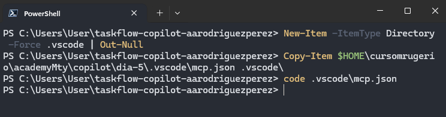

Antes de utilizarlos desde el modelo se ejecutó:

```text
comprobar-mcp.ps1
```

El script inicializó los tres servidores directamente y obtuvo sus herramientas.

El resultado fue:

```text
[OK] taskflow
[OK] playwright
[OK] aws-knowledge
RESULTADO: todos los servidores respondieron
```

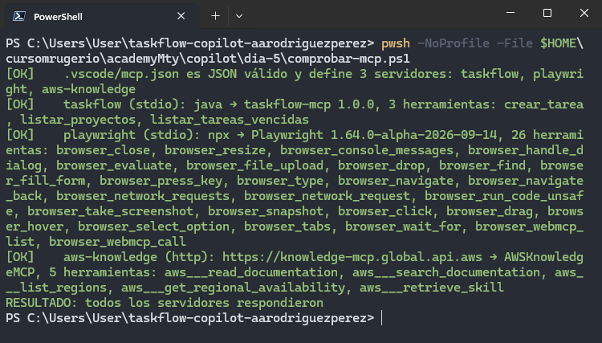

---

## MP-10 · Utilizar `taskflow` desde Copilot Chat

Con TaskFlow ejecutándose, VS Code mostró el servidor:

```text
taskflow
```

en estado:

```text
Running | Stop | Restart | 3 tools
```

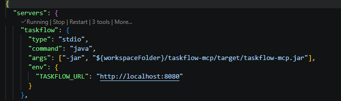

Desde el chat se pidió utilizar específicamente:

```text
listar_tareas_vencidas
```

La sección **Completed steps** permitió observar la llamada a la herramienta MCP.


El servidor devolvió la tarea vencida:

```text
id: 7
Corregir bug de fechas
```

Después se inició sesión contra la API y se comprobó directamente:

```text
GET /tasks/overdue
```

El resultado fue también:

```text
7
```

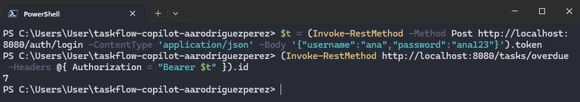

Finalmente `.vscode/mcp.json` fue agregado al repositorio y publicado en `main`.

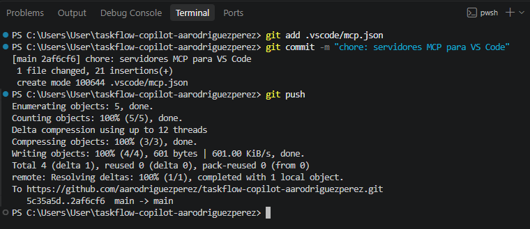

---

# Proyecto final

## PF-1 · Elegir la feature y crear la rama

Para el proyecto final se eligió:

```text
progress
```

correspondiente a:

```text
GET /reports/progress
```

La feature devuelve el porcentaje de tareas `DONE` por proyecto, redondeado a un decimal.

Se creó:

```text
feature/progress
```

y se agregó:

```text
specs/progress.md
```

en un commit independiente:

```text
spec: progress (proyecto final)
```


---

## PF-2 · Implementar con `crear-endpoint-taskflow`

La implementación se realizó mediante:

```text
/crear-endpoint-taskflow
```

con permisos limitados a escritura y ejecución de Maven.

El agente creó:

```text
ProjectProgressResponse.java
ReportController.java
ProgresoProyectosServiceTest.java
ProgresoProyectosControllerTest.java
```

y modificó:

```text
ProjectMapper.java
ProjectService.java
```

La ejecución terminó con:

```text
AI Credits: 2.99
```

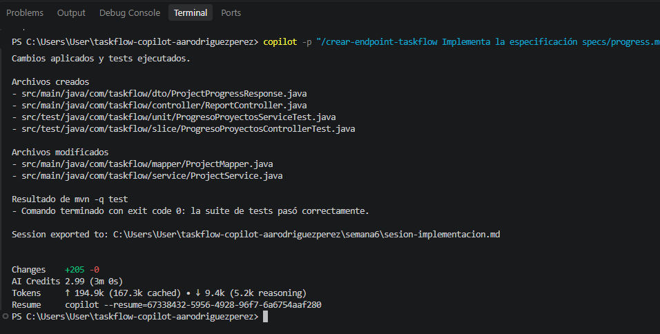

Después se realizaron las comprobaciones mecánicas:

- suite en verde;
- exactamente dos tests nuevos respecto a `main`;
- ambos con estado `A`;
- transcript con `Skill "crear-endpoint-taskflow" loaded successfully`.

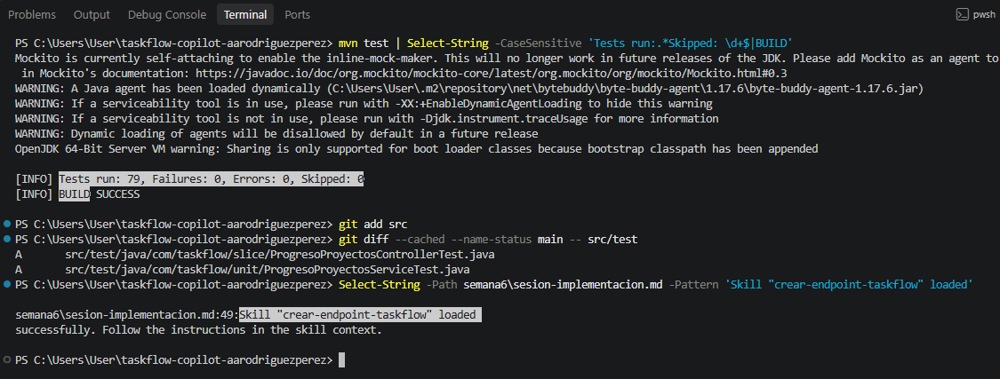

También se limpió el transcript y se buscó información sensible.

La búsqueda no devolvió:

```text
security password
Bearer ey
ghp_
gho_
github_pat_
AKIA
```

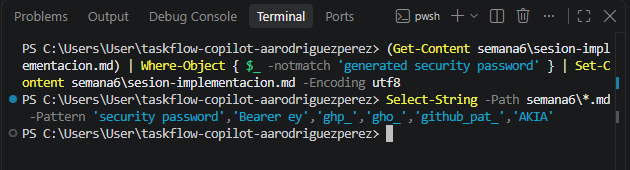

---

## PF-3 · Revisar con el agente `revisor`

Se generó:

```text
semana6/proyecto-final.diff
```

y el agente `revisor` comparó el diff contra:

```text
specs/progress.md
```

La revisión encontró únicamente sugerencias y concluyó:

```text
Casos sin test: ninguno
Veredicto: APROBADO
```

La ejecución consumió:

```text
AI Credits: 2.47
```

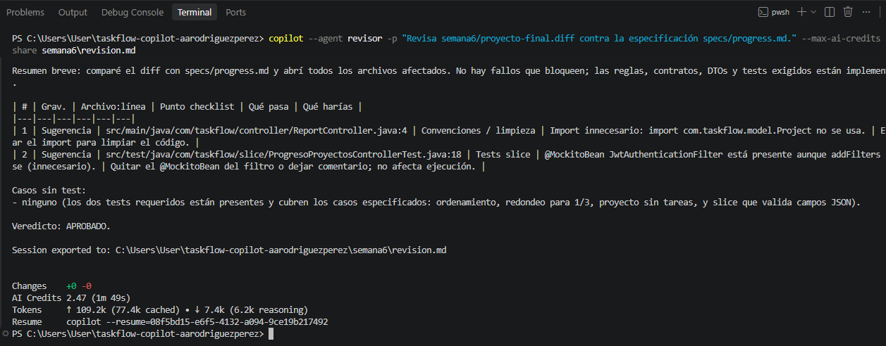

Posteriormente se verificó que el transcript contuviera `Casos sin test` y `Veredicto`, y que:

```text
git status --porcelain src
```

no imprimiera nada.


---

## PF-4 · Correcciones del revisor

Como PF-3 terminó con:

```text
Veredicto: APROBADO
```

no fue necesario ejecutar un prompt de corrección en PF-4.

Por tanto:

```text
AI Credits PF-4 = 0
```

y se continuó directamente con la verificación REST.

---

## PF-5 · Comprobar `progress` mediante REST

Se agregó:

```text
casos-progress.ps1
```

a la skill `verificar-taskflow` y se cargó desde:

```text
verificar.ps1
```

mediante:

```powershell
. (Join-Path $PSScriptRoot 'casos-progress.ps1')
```

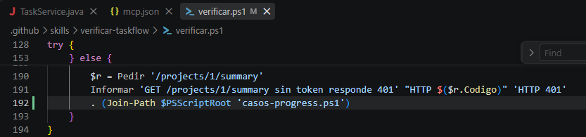

La ejecución completa validó los endpoints de los días anteriores y los casos del proyecto final.

Entre los resultados de `progress` se comprobaron:

- los tres proyectos de la semilla;
- porcentajes `20.0`, `33.3` y `0.0`;
- ausencia de detalle de tareas;
- respuesta `401` sin token.

El resultado final fue:

```text
RESULTADO: 12/12 OK
```


---

## PF-6 · Pull Request y Copilot Code Review

Se publicó `feature/progress` y se abrió:

```text
#5 - feat: progress (proyecto final)
```

Copilot fue solicitado como reviewer del Pull Request.

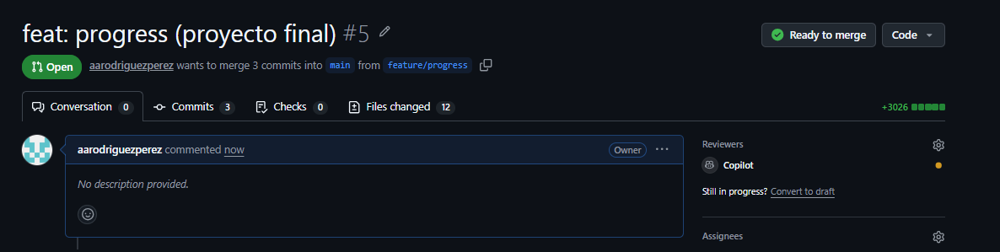

### Revisión de los comentarios

Los comentarios de Copilot no se aceptaron automáticamente.

#### 1. Import no utilizado

Se comprobó que:

```java
import com.taskflow.model.Project;
```

solo aparecía en el import de `ReportController.java`.

Por tanto, el comentario era correcto.

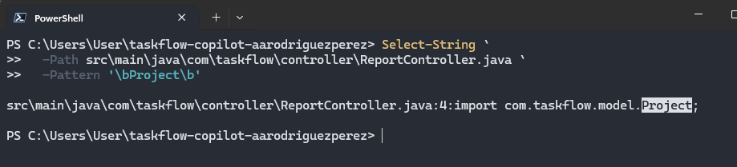

#### 2. Cobertura de autenticación

Copilot indicó que `/reports/progress` no estaba incluido en `SecurityRulesTest`.

La comprobación confirmó que ese test ya existía en `main`, por lo que modificarlo violaba la regla del proyecto final de no cambiar tests preexistentes.

También se comprobó que:

```text
casos-progress.ps1
```

ya verificaba:

```text
GET /reports/progress sin token responde 401
```

Por ello el hallazgo se documentó, pero la corrección sugerida **no se aplicó**.

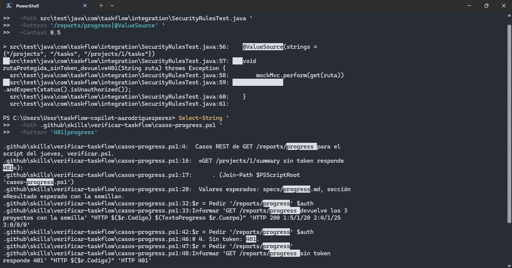

#### 3. Campos JSON incompletos en el slice

El DTO contiene:

```text
projectId
projectName
totalTasks
doneTasks
percentDone
```

pero el slice inicial no comprobaba todos esos campos.

Ese comentario sí era correcto.

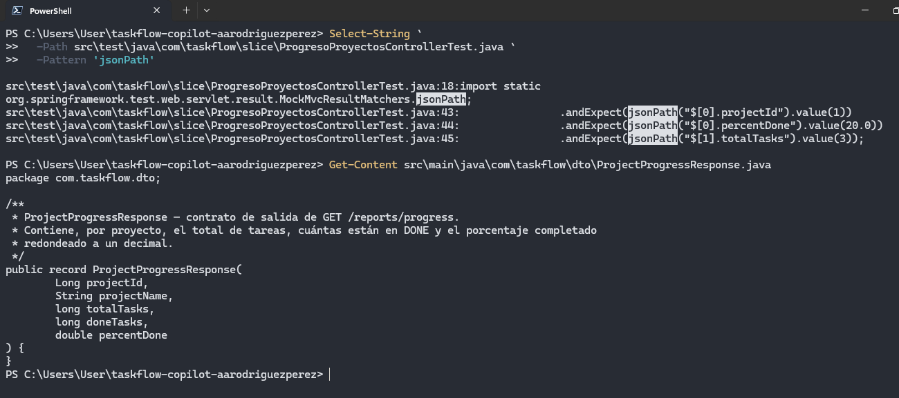

### Aplicar únicamente los comentarios válidos

Los dos comentarios aplicables se copiaron a:

```text
semana6/code-review.md
```

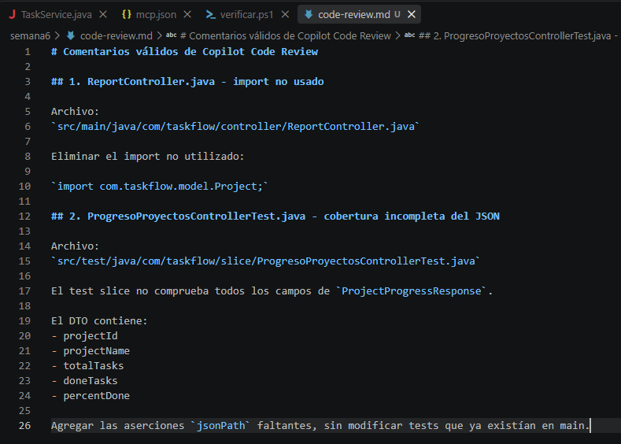

Después Copilot CLI aplicó únicamente:

- eliminación del import no usado;
- aserciones JSON faltantes en el test nuevo.

El comando consumió:

```text
AI Credits: 1.99
```

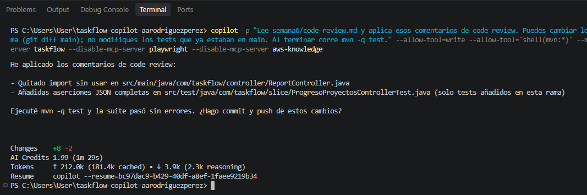

La comprobación posterior mostró:

- únicamente los dos tests nuevos respecto a `main`;
- ningún cambio en `SecurityRulesTest`;
- **79 tests**;
- `Failures: 0`;
- `Errors: 0`;
- `BUILD SUCCESS`.

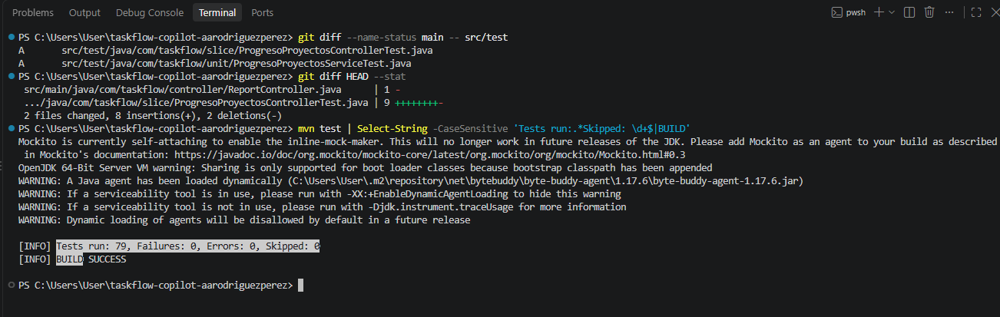

Finalmente el PR fue mergeado a `main`.


---

## PF-7 · Documento final `semana6/README.md`

La plantilla del proyecto final se copió a:

```text
semana6/README.md
```

y se completó con información real del repositorio:

- feature `progress`;
- PR `#5`;
- commit de merge;
- comentarios del Code Review;
- pasos realizados;
- correcciones;
- resultado REST;
- total de tests;
- AI Credits disponibles.

Al finalizar se ejecutó la comprobación de placeholders:

```text
Select-String -Path semana6\README.md ...
```

y no se obtuvo ninguna coincidencia.

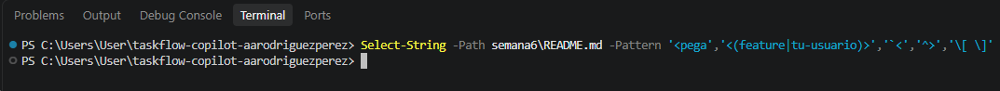

La carpeta publicada en GitHub quedó con:

```text
README.md
code-review.md
proyecto-final.diff
revision.md
sesion-implementacion.md
```


---

# Resultados del Día 05

Al finalizar se logró:

- utilizar GitHub Copilot desde VS Code con el mismo repositorio de toda la semana;
- probar autocompletado en línea y restaurar el cambio posteriormente;
- utilizar los modos Ask y Agent;
- comprobar respuestas del chat mediante búsquedas independientes;
- aprobar manualmente una ejecución de Maven;
- reutilizar desde VS Code las instrucciones, skills y agentes almacenados en `.github/`;
- demostrar nuevamente que el agente `revisor` no puede editar;
- configurar tres servidores mediante `.vscode/mcp.json`;
- comprobar sin modelo que `taskflow`, `playwright` y `aws-knowledge` respondieran;
- utilizar `listar_tareas_vencidas` desde VS Code y contrastar su salida contra REST;
- elegir `progress` como feature del proyecto final;
- implementar `GET /reports/progress` mediante `crear-endpoint-taskflow`;
- terminar PF-2 con **2.99 AI Credits**;
- obtener `Veredicto: APROBADO` en PF-3 con **2.47 AI Credits**;
- saltar PF-4 sin consumo adicional;
- obtener **12/12 OK** en la verificación REST;
- revisar individualmente los comentarios de Copilot Code Review;
- descartar una recomendación que implicaba modificar un test preexistente;
- corregir dos comentarios válidos con **1.99 AI Credits**;
- terminar con **79 tests en verde**;
- mergear el PR `#5`;
- completar y publicar `semana6/README.md` sin placeholders pendientes.

---

# Conclusión

El Día 05 permitió comprobar que el trabajo construido durante toda la semana no estaba limitado a la CLI.

Las mismas piezas del repositorio pudieron utilizarse desde VS Code:

```text
.github/copilot-instructions.md
.github/skills/
.github/agents/
```

mientras que MCP requirió una configuración propia del editor:

```text
.vscode/mcp.json
```

La práctica también mostró la diferencia entre las principales formas de asistencia:

| Mecanismo | Uso principal |
| --- | --- |
| Autocompletado | ayuda línea a línea mientras se escribe código |
| Ask | consultar y analizar sin modificar |
| Agent | ejecutar y modificar con permisos explícitos |
| Skill | reutilizar una receta de trabajo |
| Agente personalizado | limitar rol y herramientas |
| MCP | conectar herramientas y sistemas externos |

El proyecto final reunió todo el proceso de la semana: especificar antes de implementar, limitar permisos, comprobar las respuestas del agente, verificar con tests y REST, revisar un Pull Request y decidir qué recomendaciones de Copilot realmente debían aplicarse.

El resultado final fue una feature integrada a `main`, un PR revisado y mergeado y una entrega documentada dentro de `semana6/`.
